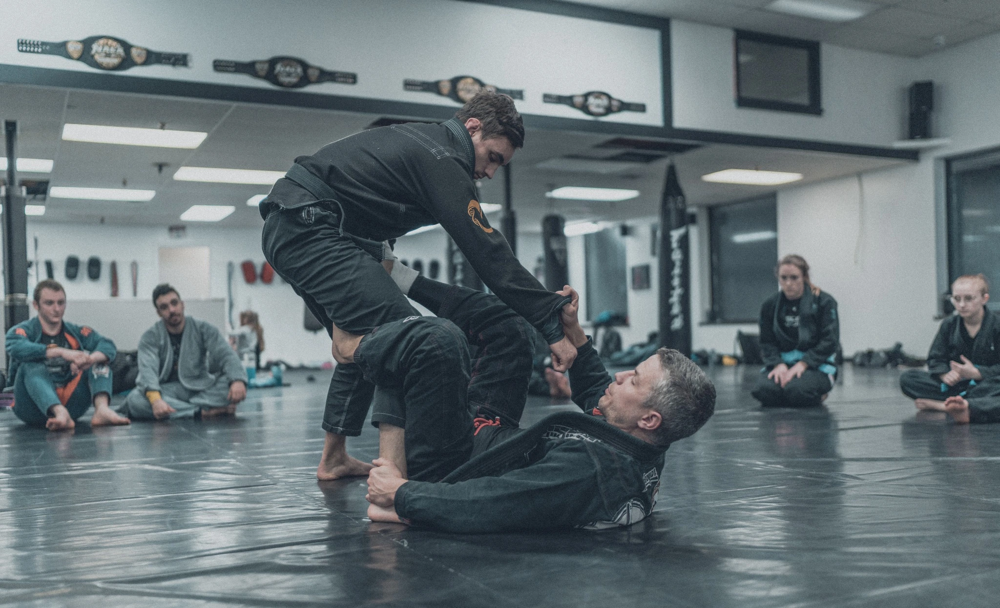
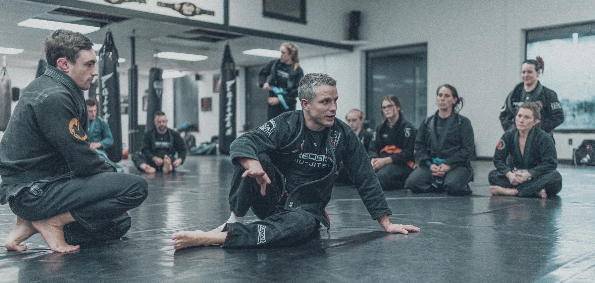

# SEO Action Plan — Precision Jiu-Jitsu — The Barracks

**Priority order:** Critical → High → Medium → Low
**Time estimate:** Critical + High = ~90 min of edits. Medium + Low = backlog.

---

## 🔴 CRITICAL — Fix before deploy or within 24h

### 1. Shorten the homepage title tag
**File:** `index.html` line 24
**Why:** Currently 76 chars — Google truncates at ~60. The truncated SERP entry will read "Precision Jiu-Jitsu — The Barracks | BJJ & MMA Acade..."

**Before:**
```html
<title>Precision Jiu-Jitsu — The Barracks | BJJ & MMA Academy in Collegeville, PA</title>
```
**After:**
```html
<title>Precision Jiu-Jitsu — BJJ & MMA Academy in Collegeville, PA</title>
```

### 2. Fix age inconsistency for Adult BJJ
**Files:** `index.html` schema (line 149), `programs.html` schema (line 58)
**Why:** Schema description says "Adults 14 and up", schema `audience` says "Adults 16+", body copy + modal dropdown say "Ages 14+". Pick 14+ everywhere (it matches what the lead modal collects).

**Fix in `programs.html` line 58:**
```json
"audience": "Adults 14+",
```

### 3. Fix `alumniOf` schema type
**File:** `instructors.html` line 58
**Why:** Schema.org `alumniOf` expects an `EducationalOrganization` or `Person` object, not a plain string. Currently fails strict validation.

**Before:**
```json
"alumniOf": "Ursinus College",
```
**After:**
```json
"alumniOf": {
  "@type": "EducationalOrganization",
  "name": "Ursinus College"
},
```

---

## 🟠 HIGH — Fix within 1 week

### 4. Pin Lucide to a fixed version
**Files:** All 7 HTML files — search for `lucide@latest`
**Why:** `@latest` means a breaking change in lucide-icons can break every icon on the site overnight. Pin it.

**Find:**
```html
<script src="https://unpkg.com/lucide@latest"></script>
```
**Replace with:**
```html
<script src="https://unpkg.com/lucide@0.460.0"></script>
```

### 5. Add `width` and `height` to every `` tag
**Why:** Prevents Cumulative Layout Shift (CLS) — a Core Web Vital. Browsers can't reserve image space without dimensions, so content jumps as images load.

Apply to every image. Example for hero:
```html

```

For below-the-fold images, also add `loading="lazy"`:
```html

```

**Hero image only on index.html:** add `fetchpriority="high"` to signal it's the LCP element.
**All other images:** add `loading="lazy"`.

### 6. Add FAQ section + FAQPage schema
**Where:** Add to `index.html` (before the Big CTA) OR create `faq.html` (preferred for SEO).
**Why:** FAQ schema is the highest-leverage missing schema for this site. Drives "People Also Ask" placements and AI Overview citations.

Suggested 8 FAQs:
1. How much do classes cost at The Barracks?
2. Do I need any experience to start Brazilian Jiu-Jitsu?
3. What age can my child start BJJ?
4. What should I wear to my first class?
5. Is BJJ safe for kids?
6. How long does it take to get a blue belt?
7. Do you offer Women's-Only classes?
8. Where are you located, and do you serve Collegeville?

Add the FAQPage JSON-LD schema to the same page.

### 7. Update AggregateRating with real Google review count
**File:** `index.html` lines 101–107
**Why:** Currently shows `reviewCount: "5"`. Real number is almost certainly higher (50+ on Google likely). Higher counts strengthen rich-result eligibility.

```json
"aggregateRating": {
  "@type": "AggregateRating",
  "ratingValue": "4.9",
  "bestRating": "5",
  "worstRating": "1",
  "reviewCount": "[ACTUAL_COUNT_FROM_GBP]"
}
```
Pull the real `reviewCount` and `ratingValue` from the Google Business Profile.

---

## 🟡 MEDIUM — Fix within 1 month

### 8. Add Schedule/Event structured data to schedule.html
**File:** `schedule.html` lines 29–48
**Why:** With 30+ recurring classes, you're eligible for Google Events markup. Currently the schema is just a `WebPage`.

Add an `Event` ItemList for the major recurring classes, e.g.:
```json
{
  "@type": "Event",
  "name": "Adult BJJ (All Levels · Gi)",
  "startDate": "2026-05-25T19:00:00-04:00",
  "eventSchedule": {
    "@type": "Schedule",
    "byDay": ["Monday", "Wednesday"],
    "startTime": "19:00",
    "endTime": "20:30",
    "scheduleTimezone": "America/New_York"
  },
  "location": { "@id": "https://precisionjjbarracks.com/#business" },
  "organizer": { "@id": "https://precisionjjbarracks.com/#business" },
  "eventStatus": "https://schema.org/EventScheduled",
  "eventAttendanceMode": "https://schema.org/OfflineEventAttendanceMode"
}
```

### 9. Add Google Business Profile to `sameAs`
**File:** `index.html` line 70–74
**Why:** Strengthens the entity link between your website and your GBP — helps Google confirm they're the same business.

```json
"sameAs": [
  "https://www.facebook.com/PrecisionJJSpringMount/",
  "https://www.instagram.com/precisionjiujitsubrx/",
  "https://x.com/pjjspringmount",
  "https://www.google.com/maps/place/[YOUR_GBP_CID]"
]
```

### 10. Fix duplicate section number on homepage
**File:** `index.html` lines 466 and 524
**Why:** Two sections labeled "04 —" looks sloppy when reading top to bottom. Cosmetic, but readers notice.

- Section "Inside The Barracks" → stays at `04`
- Section "Actual Google Reviews" → change to `05`
- Bump "Big CTA" implied numbering accordingly.

### 11. Remove `<meta name="keywords">`
**File:** `index.html` line 7
**Why:** Google ignores it. Bing semi-ignores it. Other engines treat it as a weak spam signal. Remove for cleanliness.

### 12. Convert `.jpg` images to `.webp`
**Where:** `images/gallery/adult-muay-thai.jpg` (line 366 of index.html) — and any other `.jpg` references.
**Why:** Consistency + smaller file size. Use `cwebp` or any image converter.

```bash
cwebp -q 82 images/gallery/adult-muay-thai.jpg -o images/gallery/adult-muay-thai.webp
```
Then update the `` and `data-local` references.

---

## 🟢 LOW — Backlog

### 13. Remove GSAP from `booking.html`
**File:** `booking.html` lines 152–153
**Why:** Booking page is a funnel page — keep it as light as possible. GSAP isn't used here.

Remove:
```html
<script src="https://cdnjs.cloudflare.com/ajax/libs/gsap/3.12.5/gsap.min.js"></script>
<script src="https://cdnjs.cloudflare.com/ajax/libs/gsap/3.12.5/ScrollTrigger.min.js"></script>
```

### 14. Add secondary phone to schema
**File:** `index.html` schema (line 44)
**Why:** You list `(484) 897-7700` in footer + contact page but only `(445) 867-1238` in schema. If the second line is monitored, add it.

```json
"telephone": "+1-445-867-1238",
"contactPoint": [
  {
    "@type": "ContactPoint",
    "telephone": "+1-484-897-7700",
    "contactType": "secondary"
  }
]
```

### 15. Update sitemap `lastmod` whenever you push changes
**File:** `sitemap.xml`
**Why:** Currently all entries show `2026-04-15`. Update to the actual deploy date and bump whenever a page changes.

### 16. Consider `priceRange` specificity
**File:** `index.html` line 46
Current: `"priceRange": "$$"` — generic
Better: actual range, e.g. `"$150 - $200"`

---

## Re-Run Schedule

| When | What |
|------|------|
| **After CRITICAL fixes** | Re-run this audit to confirm |
| **After Cloudflare deploy** | Run full live audit (covers CWV, security headers, redirects) |
| **30 days post-launch** | Re-audit with Google Search Console data |
| **Before each programmatic SEO phase ship** | Audit the new pages before push |

---

## Score Impact Projection

| Action | Score Gain |
|--------|-----------|
| Fix CRITICAL (1–3) | +3 pts → 90 |
| Fix HIGH (4–7) | +5 pts → 95 |
| Fix MEDIUM (8–12) | +3 pts → 98 |
| Fix LOW (13–16) | +1 pt → 99 |

Realistically, you're shipping a 90/100 site once the CRITICAL items are fixed. That's tournament-ready.
